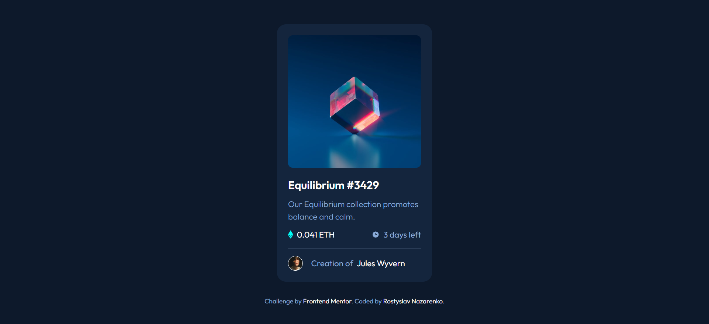
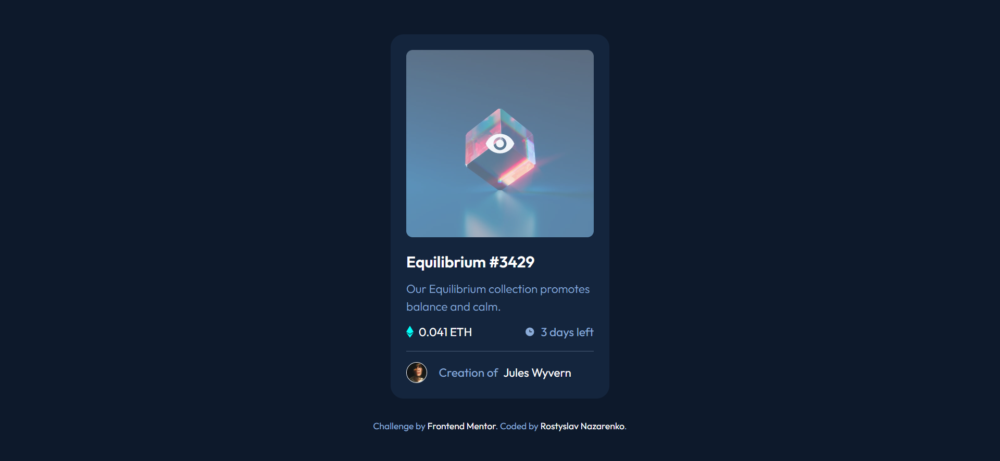

# Frontend Mentor - NFT preview card component solution

This is a solution to the [NFT preview card component challenge on Frontend Mentor](https://www.frontendmentor.io/challenges/nft-preview-card-component-SbdUL_w0U).

## Table of contents

- [Overview](#overview)
  - [Screenshot](#screenshot)
  - [Links](#links)
- [My process](#my-process)
  - [General Overview](#general-overview)
  - [Built with](#built-with)
  - [What I learned](#what-i-learned)
  - [Continued development](#continued-development)
  - [Useful resources](#useful-resources)
- [Author](#author)
- [Acknowledgments](#acknowledgments)

## Overview

### Screenshot

#### Mobile/Desktop view

#### Hover state

### Links

- Solution URL: [Github](https://github.com/rostyslav-nazarenko/nft-preview-card-component)
- Live Site URL: [Github Pages](https://rostyslav-nazarenko.github.io/nft-preview-card-component/)

## My process

### General overview

First time had experience with transitions. Making icon and background color appear on hover was definitely a challenge.

### Built with

- HTML5 and CSS
- Flexbox
- Transition

### What I learned

A little bit experience with transitions.

### Continued development

Look further into transitions and animations.

### Useful resources

## Author

- Frontend Mentor - [Rostyslav Nazarenko](https://www.frontendmentor.io/profile/rostyslav-nazarenko)

## Acknowledgments
